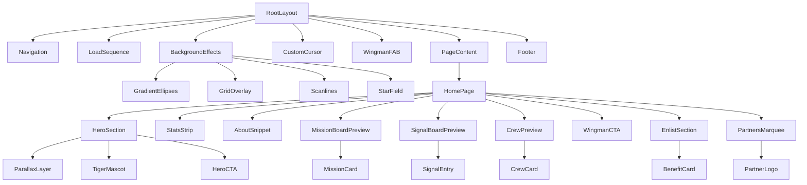
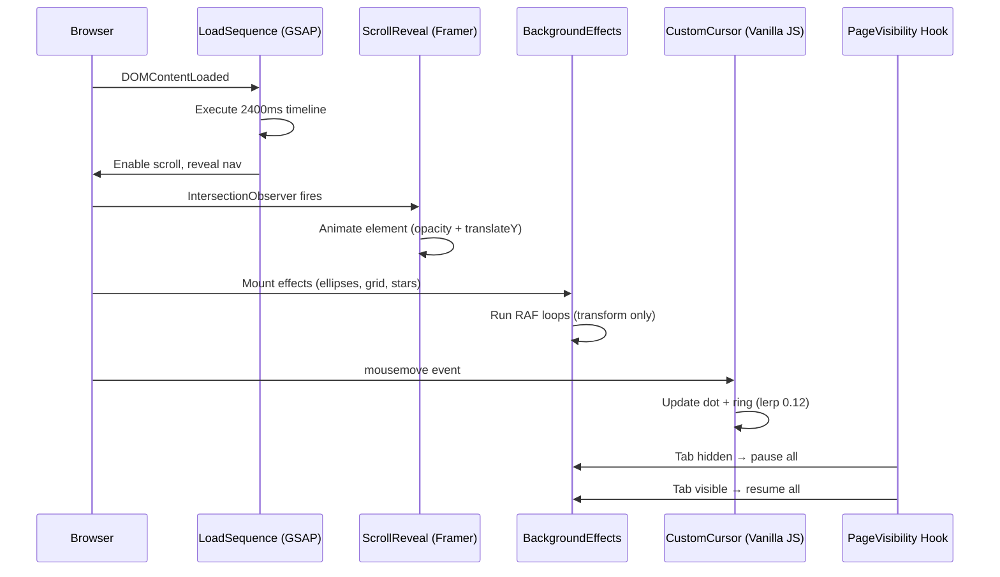
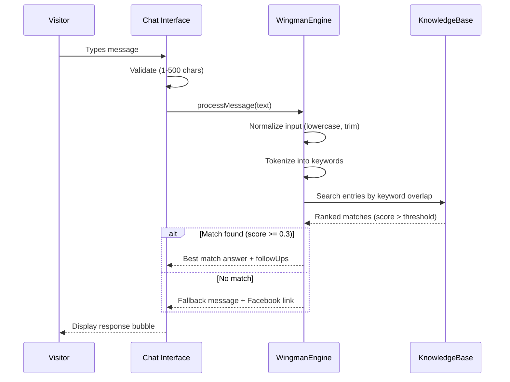

# Design Document: AWS Cloud Club — Global City Website

## Overview

A dark cinematic Next.js 14 website for AWS Cloud Club — STI Global City (AWSCC – STI BGC), built with the App Router and deployed on Vercel. The site uses a "Top Gun meets AWS" aesthetic — aviation-coded UI, a tiger mascot named "Rory" as the Cloud Pilot, and a classified mission briefing system feel. The architecture prioritizes GPU-accelerated animations, code-split bundles, and a knowledge-base-driven AI chatbot, all while maintaining WCAG accessibility and Lighthouse 90+ performance.

The site consists of 8 routes: Home (10 sections), About, Missions, Crew, Signals, Wingman, Enlist, and Apply (redirect). Data is statically defined in JSON/TS files with no external CMS — officers, events, announcements, and partners are managed as typed constants. The AI Wingman uses client-side keyword matching against a structured knowledge base.

## Architecture

```mermaid
graph TD
    subgraph Vercel["Vercel Edge Network"]
        CDN[CDN / Edge Cache]
    end

    subgraph NextApp["Next.js 14 App Router"]
        Layout[RootLayout]
        Layout --> Nav[Navigation]
        Layout --> Main[Page Content]
        Layout --> Footer[Footer]
        Layout --> Cursor[CustomCursor]
        Layout --> BgEffects[BackgroundEffects]
        Layout --> Wingman[WingmanFAB]
    

        subgraph Pages["Route Pages"]
            Home[/ Home]
            About[/about]
            Missions[/missions]
            Crew[/crew]
            Signals[/signals]
            WingmanPage[/wingman]
            Enlist[/enlist]
            Apply[/apply → redirect]
        end

        Main --> Pages
    end

    subgraph DataLayer["Data Layer"]
        Events[events.ts]
        Officers[officers.ts]
        Announcements[announcements.ts]
        Partners[partners.ts]
        KnowledgeBase[wingman-kb.ts]
        Stats[stats.ts]
    end

    Pages --> DataLayer
    CDN --> NextApp
```

## Component Hierarchy



## File and Folder Structure

```
src/
├── app/
│   ├── layout.tsx              # RootLayout: fonts, metadata, global providers
│   ├── template.tsx            # AnimatePresence page transition wrapper
│   ├── page.tsx                # Home page (10 sections)
│   ├── not-found.tsx           # Custom 404 page
│   ├── about/
│   │   └── page.tsx
│   ├── missions/
│   │   └── page.tsx
│   ├── crew/
│   │   └── page.tsx
│   ├── signals/
│   │   └── page.tsx
│   ├── wingman/
│   │   └── page.tsx
│   ├── enlist/
│   │   └── page.tsx
│   └── apply/
│       └── route.ts            # Redirect handler (308 → /enlist)
├── components/
│   ├── layout/
│   │   ├── Navigation.tsx
│   │   ├── Footer.tsx
│   │   └── MobileMenu.tsx
│   ├── hero/
│   │   ├── HeroSection.tsx
│   │   ├── ParallaxLayer.tsx
│   │   ├── TigerMascot.tsx
│   │   └── LoadSequence.tsx
│   ├── sections/
│   │   ├── StatsStrip.tsx
│   │   ├── AboutSnippet.tsx
│   │   ├── MissionBoardPreview.tsx
│   │   ├── SignalBoardPreview.tsx
│   │   ├── CrewPreview.tsx
│   │   ├── WingmanCTA.tsx
│   │   ├── EnlistSection.tsx
│   │   └── PartnersMarquee.tsx
│   ├── cards/
│   │   ├── MissionCard.tsx
│   │   ├── SignalEntry.tsx
│   │   ├── CrewCard.tsx
│   │   ├── BenefitCard.tsx
│   │   └── PartnerLogo.tsx
│   ├── wingman/
│   │   ├── WingmanFAB.tsx
│   │   ├── WingmanPanel.tsx
│   │   ├── WingmanFullPage.tsx
│   │   ├── ChatBubble.tsx
│   │   └── ChatInput.tsx
│   ├── effects/
│   │   ├── BackgroundEffects.tsx
│   │   ├── GradientEllipses.tsx
│   │   ├── GridOverlay.tsx
│   │   ├── Scanlines.tsx
│   │   ├── StarField.tsx
│   │   └── CustomCursor.tsx
│   ├── animations/
│   │   ├── ScrollReveal.tsx
│   │   ├── PageTransition.tsx
│   │   ├── TypewriterText.tsx
│   │   ├── CountUp.tsx
│   │   ├── StampIn.tsx
│   │   └── variants.ts           # All Framer Motion variant definitions
│   ├── forms/
│   │   ├── EnlistForm.tsx
│   │   └── FormField.tsx
│   └── ui/
│       ├── Button.tsx
│       ├── Badge.tsx
│       ├── SectionLabel.tsx
│       └── SkipNav.tsx
├── data/
│   ├── events.ts
│   ├── officers.ts
│   ├── announcements.ts
│   ├── partners.ts
│   ├── stats.ts
│   └── wingman-kb.ts
├── lib/
│   ├── animations.ts           # GSAP timeline configs, Framer variants
│   ├── wingman-engine.ts       # Keyword matching + response logic
│   ├── utils.ts                # Shared utilities
│   └── constants.ts            # Color tokens, breakpoints, timing
├── hooks/
│   ├── useIntersectionObserver.ts
│   ├── useParallax.ts
│   ├── usePageVisibility.ts
│   ├── useReducedMotion.ts
│   ├── useCountUp.ts
│   └── useMediaQuery.ts
├── styles/
│   ├── globals.css             # Tailwind directives, CSS vars, keyframes
│   ├── cursor.css              # Custom cursor styles
│   └── animations.css          # Complex keyframe definitions
└── types/
    └── index.ts                # All TypeScript interfaces/types
```

## Data Models

### Events (Mission Board)

```typescript
interface MissionEvent {
  id: string;
  name: string;
  date: string;                    // ISO 8601 date
  description: string;             // Max 120 chars for card display
  fullDescription?: string;        // Extended description for detail view
  status: 'UPCOMING' | 'ACTIVE' | 'COMPLETED';
  location?: string;
  tags?: string[];
}
```

### Officers (Crew Roster)

```typescript
interface Officer {
  id: string;
  name: string;
  role: string;                    // e.g., "University Captain & CEO"
  office: string;                  // e.g., "Executive Office"
  photo: string;                   // Path to officer photo
  description: string;             // Max 150 chars for card back
  socials: SocialLink[];           // Max 4 links
  order: number;                   // Display priority
}

interface SocialLink {
  platform: 'github' | 'linkedin' | 'facebook' | 'instagram' | 'twitter';
  url: string;
}
```

### Announcements (Signal Board)

```typescript
interface Announcement {
  id: string;
  content: string;
  date: string;                    // ISO 8601 date
  pinned: boolean;
  category?: 'general' | 'event' | 'recruitment' | 'achievement';
}
```

### Partners

```typescript
interface Partner {
  id: string;
  name: string;
  logo: string;                    // Path to logo image
  url?: string;
}
```

### Stats

```typescript
interface StatMetric {
  id: string;
  label: string;                   // e.g., "Members", "Events Held"
  value: number;                   // Target number for count-up
  suffix?: string;                 // e.g., "+" for "120+"
}
```

### Form Submissions (Enlist)

```typescript
interface EnlistFormData {
  fullName: string;                // 1–100 characters
  email: string;                   // Must match STI domain pattern
  yearLevel: '1st' | '2nd' | '3rd' | '4th';
  program: string;                 // Selected from predefined list
  submittedAt: string;             // ISO 8601 timestamp
}

interface FormValidationError {
  field: keyof EnlistFormData;
  message: string;
}
```

### AI Wingman Knowledge Base

```typescript
interface KnowledgeEntry {
  id: string;
  topic: 'identity' | 'officers' | 'membership' | 'events' | 'departments' | 'buildhers' | 'application';
  keywords: string[];              // Trigger words for matching
  question: string;                // Canonical question form
  answer: string;                  // Rory's response in character (aviation persona)
  followUp?: string[];             // Suggested follow-up question chips
  priority: number;                // Higher = preferred when multiple matches (1-10)
}

interface ChatMessage {
  id: string;
  role: 'user' | 'wingman';
  content: string;
  timestamp: number;
  topic?: KnowledgeEntry['topic']; // Topic tag for visual indicator
}

interface MatchResult {
  matched: boolean;
  answer: string;
  followUps?: string[];
  topic?: KnowledgeEntry['topic'];
}
```

## Animation System Architecture



### Animation Layers

The animation system is split into four independent layers that never block each other:

**Layer 1: GSAP (Orchestrated Timelines)**
- Page load sequence (2400ms boot-up)
- Hero parallax (scroll-linked via ScrollTrigger)
- Tiger mascot mouse tracking (RAF + lerp)
- Complex multi-step sequences

**Layer 2: Framer Motion (Page Transitions + Scroll Reveals + Interactions)**
- **Page transitions**: `AnimatePresence` wrapping route content with exit/enter animations
- **Layout animations**: `layout` prop on cards and list items for smooth reflow
- Section entrance animations (opacity + translateY)
- Card entrance (+ rotateX correction)
- Staggered children (80ms intervals)
- Spring physics for Signal Board entries
- `whileInView` with `once: true` to prevent re-triggering
- **Gesture animations**: `whileHover`, `whileTap`, `drag` on interactive elements
- **Shared layout transitions**: `layoutId` for navigating between card preview → full page

**Layer 3: Framer Motion (Micro-interactions + Transitions)**
- Button press feedback: `whileTap={{ scale: 0.97 }}`
- Card hover lift: `whileHover={{ y: -8, transition: { type: 'spring', stiffness: 300 } }}`
- Navigation link underline: `motion.span` with `layoutId` for active indicator
- Mobile menu: `AnimatePresence` with slide-from-right + backdrop fade
- FAB expansion: `motion.div` with `layout` + clip-path transition
- Form field focus: border color animate via `motion.input`
- Toast/notification entry: slide-up + spring overshoot
- Badge pulse: `motion.span` with infinite repeat transition
- Icon rotation on hover: `motion.svg` with `whileHover={{ rotate: 360 }}`

**Layer 4: CSS Animations (Always-on Ambient)**
- Status badge pulses (keyframe loops)
- Scroll indicator bounce
- Partners marquee (infinite translateX)
- Blinking indicators (opacity keyframes)
- Glow pulses (box-shadow keyframes)
- Gradient border rotation (conic-gradient animation)

### Page Transition System (Framer Motion AnimatePresence)

```typescript
// components/layout/PageTransition.tsx
// Wraps all page content with AnimatePresence for route transitions

const pageVariants = {
  initial: { 
    opacity: 0, 
    y: 20, 
    filter: 'blur(4px)',
  },
  enter: { 
    opacity: 1, 
    y: 0, 
    filter: 'blur(0px)',
    transition: { 
      duration: 0.4, 
      ease: [0.25, 0.46, 0.45, 0.94], // custom easeOut
      staggerChildren: 0.06,
    },
  },
  exit: { 
    opacity: 0, 
    y: -10,
    filter: 'blur(2px)',
    transition: { duration: 0.25, ease: 'easeIn' },
  },
};

// Used in app/template.tsx:
// <AnimatePresence mode="wait">
//   <motion.div key={pathname} variants={pageVariants} initial="initial" animate="enter" exit="exit">
//     {children}
//   </motion.div>
// </AnimatePresence>
```

### Gesture and Interaction Animations

```typescript
// Reusable motion presets for interactive elements

const buttonMotion = {
  whileHover: { scale: 1.02, transition: { type: 'spring', stiffness: 400 } },
  whileTap: { scale: 0.97 },
};

const cardMotion = {
  whileHover: { 
    y: -8, 
    boxShadow: '0 20px 60px rgba(77,163,255,0.12)',
    borderColor: 'rgba(77,163,255,0.3)',
    transition: { type: 'spring', stiffness: 300, damping: 20 },
  },
};

const iconMotion = {
  whileHover: { rotate: 12, scale: 1.1 },
  whileTap: { scale: 0.9 },
  transition: { type: 'spring', stiffness: 400, damping: 10 },
};

const listItemMotion = {
  layout: true,  // Smooth reorder/resize animations
  initial: { opacity: 0, x: -20 },
  animate: { opacity: 1, x: 0 },
  exit: { opacity: 0, x: 20, transition: { duration: 0.2 } },
};

const fabExpandMotion = {
  initial: { scale: 0, borderRadius: '50%' },
  animate: { 
    scale: 1, 
    borderRadius: '16px',
    transition: { type: 'spring', stiffness: 260, damping: 20 },
  },
  exit: { 
    scale: 0, 
    borderRadius: '50%',
    transition: { duration: 0.3, ease: 'easeIn' },
  },
};
```

### Navigation Active Indicator (Shared Layout)

```typescript
// Motion-powered active page indicator that slides between nav links
// Uses layoutId for smooth shared-element transition

// <motion.span
//   layoutId="nav-indicator"
//   className="absolute bottom-0 left-0 right-0 h-[2px] bg-accent-blue"
//   transition={{ type: 'spring', stiffness: 380, damping: 30 }}
// />
```

### Mobile Menu Animation

```typescript
const mobileMenuVariants = {
  closed: { 
    x: '100%', 
    transition: { type: 'spring', stiffness: 300, damping: 30 },
  },
  open: { 
    x: '0%', 
    transition: { type: 'spring', stiffness: 300, damping: 30 },
  },
};

const menuBackdropVariants = {
  closed: { opacity: 0 },
  open: { opacity: 1, transition: { duration: 0.3 } },
};

const menuItemVariants = {
  closed: { opacity: 0, x: 20 },
  open: (i: number) => ({
    opacity: 1,
    x: 0,
    transition: { delay: i * 0.05, type: 'spring', stiffness: 300 },
  }),
};
```

### Wingman Chat Animations

```typescript
const chatBubbleVariants = {
  initial: { opacity: 0, y: 12, scale: 0.95 },
  animate: { 
    opacity: 1, 
    y: 0, 
    scale: 1,
    transition: { type: 'spring', stiffness: 400, damping: 25 },
  },
};

const typingIndicatorVariants = {
  animate: {
    y: [0, -6, 0],
    transition: { 
      duration: 0.4, 
      repeat: Infinity, 
      repeatDelay: 0.1,
    },
  },
};

const panelVariants = {
  closed: { 
    clipPath: 'circle(0% at calc(100% - 32px) calc(100% - 32px))',
    transition: { duration: 0.3, ease: 'easeIn' },
  },
  open: { 
    clipPath: 'circle(150% at calc(100% - 32px) calc(100% - 32px))',
    transition: { duration: 0.5, ease: [0.25, 0.46, 0.45, 0.94] },
  },
};
```

### Stats Count-Up with Spring

```typescript
// Enhanced count-up using Framer Motion's useSpring + useMotionValue
// for butter-smooth number interpolation

const countUpMotion = {
  initial: { opacity: 0, y: 20 },
  whileInView: { 
    opacity: 1, 
    y: 0,
    transition: { duration: 0.6, ease: 'easeOut' },
  },
  viewport: { once: true, amount: 0.5 },
};

// Each number uses:
// const motionValue = useMotionValue(0);
// const springValue = useSpring(motionValue, { stiffness: 60, damping: 20 });
// Triggers: motionValue.set(targetValue) when inView
```

### Enlist Section Stamp Animation

```typescript
const stampVariants = {
  hidden: { 
    opacity: 0, 
    scale: 1.08, 
    rotate: -1,
  },
  visible: { 
    opacity: 1, 
    scale: 1, 
    rotate: 0,
    transition: { 
      duration: 0.4, 
      ease: 'easeOut',
      // Slight overshoot for "stamp" impact feel
      scale: { type: 'spring', stiffness: 300, damping: 15 },
    },
  },
};

const benefitCardVariants = {
  hidden: { opacity: 0, y: 30 },
  visible: (i: number) => ({
    opacity: 1,
    y: 0,
    transition: { 
      delay: i * 0.1, 
      type: 'spring', 
      stiffness: 200, 
      damping: 20 
    },
  }),
};
```

### GSAP Load Sequence Timeline

```typescript
// lib/animations.ts — Load sequence configuration
const loadTimeline = {
  total: 2400,
  steps: [
    { at: 0,    action: 'fadeIn logo',         duration: 600, ease: 'power2.out' },
    { at: 400,  action: 'spring-scale logo',   from: 0.95, to: 1.0 },
    { at: 800,  action: 'typewriter "AWS CLOUD CLUB"', charDelay: 50 },
    { at: 1200, action: 'slideUp "GLOBAL CITY"', y: 20, duration: 300 },
    { at: 1600, action: 'cloudFog left+right',  duration: 400 },
    { at: 2000, action: 'fadeIn tiger',         duration: 400 },
    { at: 2400, action: 'fadeIn nav+CTAs',      duration: 300 },
  ],
  skipCondition: 'sessionStorage.getItem("awscc-loaded") !== null',
};
```

### Framer Motion Variant Library

```typescript
// lib/animations.ts — Reusable Framer Motion variants
// Also exported from components/animations/variants.ts for component use

const scrollRevealVariants = {
  hidden: { opacity: 0, y: 40 },
  visible: {
    opacity: 1,
    y: 0,
    transition: { duration: 0.6, ease: 'easeOut' },
  },
};

const cardRevealVariants = {
  hidden: { opacity: 0, y: 40, rotateX: 4 },
  visible: {
    opacity: 1,
    y: 0,
    rotateX: 0,
    transition: { duration: 0.6, ease: 'easeOut' },
  },
};

const staggerContainer = {
  hidden: {},
  visible: {
    transition: { staggerChildren: 0.08 },
  },
};

const springEntry = {
  hidden: { opacity: 0, x: 60 },
  visible: {
    opacity: 1,
    x: 0,
    transition: { type: 'spring', stiffness: 200, damping: 20 },
  },
};

const fadeInUp = {
  hidden: { opacity: 0, y: 24 },
  visible: { 
    opacity: 1, 
    y: 0,
    transition: { duration: 0.5, ease: [0.25, 0.46, 0.45, 0.94] },
  },
};

const scaleIn = {
  hidden: { opacity: 0, scale: 0.9 },
  visible: {
    opacity: 1,
    scale: 1,
    transition: { type: 'spring', stiffness: 200, damping: 20 },
  },
};

const slideFromLeft = {
  hidden: { opacity: 0, x: -40 },
  visible: {
    opacity: 1,
    x: 0,
    transition: { duration: 0.5, ease: 'easeOut' },
  },
};

const slideFromRight = {
  hidden: { opacity: 0, x: 40 },
  visible: {
    opacity: 1,
    x: 0,
    transition: { type: 'spring', stiffness: 200, damping: 20 },
  },
};
```

### Custom Cursor Implementation

```typescript
// Vanilla JS — ~30 lines, no dependencies
// Mounted in RootLayout via useEffect, disabled below 768px
// Uses transform: translate3d() for GPU acceleration
// States: default (8px dot + 32px ring), hover-cta (48px ring, orange fill),
//         hover-tiger (reticle crosshairs), hover-interactive (dot hidden)
// Lerp factor: 0.12 per RAF tick for ring, 1.0 for dot (instant)
```

### Parallax System

```typescript
// Hero parallax — scroll-linked via GSAP ScrollTrigger
const parallaxConfig = {
  layers: [
    { id: 'starfield',  speed: 0.1, element: 'tsParticles canvas' },
    { id: 'clouds',     speed: 0.2, element: 'cloud images' },
    { id: 'tiger',      speed: 0.5, element: 'Rory mascot' },
    { id: 'headline',   speed: 1.0, element: 'text content' },
  ],
  mouseParallax: {
    target: 'tiger',
    maxRotation: 8,       // degrees
    lerpFactor: 0.08,
    updateMethod: 'requestAnimationFrame',
  },
  mobile: {
    activeLayers: 2,      // Only starfield + headline on <768px
    mouseParallax: false,
  },
};
```

### Reduced Motion Strategy

When `prefers-reduced-motion: reduce` is detected:
- All parallax effects → disabled
- Scroll reveals → instant (opacity only, no transform)
- Load sequence → skip entirely, show final state
- Particle effects → disabled
- Custom cursor → disabled (use system cursor)
- Marquee → static display
- Status badge pulses → static color
- Scan-line sweeps → disabled
- Typewriter reveals → instant text display
- Preserved: focus indicators, content visibility toggles, nav open/close

## AI Wingman Chatbot Design



### Matching Algorithm

```typescript
// lib/wingman-engine.ts
function matchQuery(input: string, knowledgeBase: KnowledgeEntry[]): MatchResult {
  const tokens = normalize(input).split(/\s+/);
  
  const scored = knowledgeBase.map(entry => ({
    entry,
    score: calculateOverlap(tokens, entry.keywords),
  }));
  
  const best = scored.sort((a, b) => b.score - a.score)[0];
  
  if (best.score >= MATCH_THRESHOLD) {
    return { matched: true, answer: best.entry.answer, followUps: best.entry.followUp };
  }
  
  return { matched: false, answer: FALLBACK_MESSAGE };
}

function calculateOverlap(tokens: string[], keywords: string[]): number {
  const matches = tokens.filter(t => keywords.some(k => k.includes(t) || t.includes(k)));
  return matches.length / Math.max(tokens.length, 1);
}
```

### Knowledge Base Structure

The Rory AI Wingman has a comprehensive knowledge base drawn from the club's full constitution and brand identity. Rory speaks in a friendly, aviation-themed tone — using call signs, flight metaphors, and the Cloud Pilot persona.

**Rory's Personality:**
- Speaks as the club mascot — a tiger with aviator goggles
- Uses aviation terminology: "Roger that, Cloud Pilot!", "You're cleared for info!", "Copy that!"
- Friendly, encouraging, never robotic
- Signs off responses with tiger/aviation flair

**Knowledge Domains (7 categories):**

1. **Club Identity** — Full name (AWS Cloud Club – Systems Technology Institute Global City Taguig), acronyms (AWSCC – STI BGC), location (STI Academic Center, University Parkway Drive, BGC, Taguig, 1634 Metro Manila), founded 2024, affiliations (AWS User Group Philippines, AWS Academic Advocacy), vision, mission, goals
2. **Officers & Structure** — Board of Executives (16 positions: CEO, Executive Secretary, Associate Secretary, CFO, Vice-CFO, COO, Vice-COO, CMO, Vice-CMO, CRO, Vice-CRO, CCO, Vice-CCO, Associate Creatives, BuildHers+ Ambassador, IoT Dev Officer), offices (Executive, Finance, Operations, Marketing, Relations, Creatives), Skill Builder departments (7 specializations)
3. **Membership** — Eligibility (any bona fide STI student, no discrimination), requirements (membership form, registration form softcopy, 2x2 photo within 6 months), revalidation requirements (per semester: certifications/badges, community engagements, chapter event participation), termination conditions, certificate of membership requirements (LinkedIn account + AWS Cloud Clubs Philippines Regional Meetup)
4. **Events** — Current/upcoming events from data, past events, how to register, event types (workshops, seminars, training sessions)
5. **Departments** — 7 Skill Builder specializations (Software & Web Dev, Security, Cloud Computing, ML/AI, Data Analytics, Advanced Network & Infrastructure, IoT Development), department head qualifications (2.75 GWA minimum)
6. **BuildHers+** — Women and LGBTQIA+ community, ambassador roles, director roles, membership requirements (identify as woman/LGBTQIA+/ally, must be active Cloud Club member)
7. **Application Process** — Step-by-step join flow, what happens after submission (reviewed within 48 hours), what's needed (duly signed form, registration form softcopy, 2x2 photo), no experience required message

```typescript
// data/wingman-kb.ts — Expanded knowledge base structure

interface KnowledgeEntry {
  id: string;
  topic: 'identity' | 'officers' | 'membership' | 'events' | 'departments' | 'buildhers' | 'application';
  keywords: string[];
  question: string;
  answer: string;                  // Rory's response in character
  followUp?: string[];
  priority: number;                // Higher = preferred when multiple matches
}

// Example entries:
const knowledgeBase: KnowledgeEntry[] = [
  {
    id: 'what-is-awscc',
    topic: 'identity',
    keywords: ['what', 'club', 'awscc', 'aws', 'cloud', 'about'],
    question: 'What is AWS Cloud Club Global City?',
    answer: "Roger that, Cloud Pilot! 🐯 AWS Cloud Club – STI Global City is a special-interest, non-profit student organization at STI Academic Center in Bonifacio Global City, Taguig. We're affiliated with AWS User Group Philippines and AWS Academic Advocacy. Founded in 2024, we're the AI-focused Cloud Club that no other chapter has. Our mission: empower students to build with AWS and thrive in the digital economy!",
    followUp: ['How do I join?', 'What departments do you have?', 'Where are you located?'],
    priority: 10,
  },
  {
    id: 'how-to-join',
    topic: 'application',
    keywords: ['join', 'apply', 'enlist', 'member', 'sign up', 'register', 'membership'],
    question: 'How do I join the club?',
    answer: "You're cleared for enlistment, future Cloud Pilot! 🛫 Here's your preflight checklist:\n\n1. Fill out the membership form (electronic via our site)\n2. Submit a softcopy of your latest STI Registration Form\n3. Provide a 2x2 photo taken within 6 months\n\nNo experience required — just the drive to build! Applications are reviewed within 48 hours. Open to ALL bona fide STI students. Hit that 'Enlist as Cloud Pilot' button to start!",
    followUp: ['What are the requirements?', 'What happens after I apply?', 'Do I need AWS experience?'],
    priority: 10,
  },
  {
    id: 'departments',
    topic: 'departments',
    keywords: ['department', 'specialization', 'skill', 'builder', 'track', 'focus'],
    question: 'What departments/specializations are available?',
    answer: "We've got 7 Skill Builder squadrons, Cloud Pilot! Pick your flight path:\n\n✈️ Software & Web Development\n✈️ Security\n✈️ Cloud Computing\n✈️ Machine Learning & AI\n✈️ Data Analytics\n✈️ Advanced Network & Infrastructure\n✈️ Internet of Things Development\n\nEach department has a dedicated head and runs hands-on training. You can specialize in what fires you up most!",
    followUp: ['How do I pick a department?', 'What about the offices?', 'Who leads each department?'],
    priority: 8,
  },
  {
    id: 'officers-structure',
    topic: 'officers',
    keywords: ['officer', 'leader', 'captain', 'ceo', 'board', 'executive', 'who runs'],
    question: 'Who are the club officers?',
    answer: "Here's our flight crew command structure! 🎖️\n\nThe Board of Executives includes:\n• University Captain & CEO — leads the entire organization\n• Executive Secretary & Associate Secretary\n• Co-Captain & CFO — finance and resources\n• COO — operations and events\n• CMO — marketing and branding\n• CRO — relations and partnerships\n• CCO — creatives and graphics\n\nPlus Vice-officers, BuildHers+ Ambassadors, and our IoT Development Officer. Check the /crew page for the full roster with photos!",
    followUp: ['Tell me about BuildHers+', 'What does each office do?', 'How do I become an officer?'],
    priority: 7,
  },
  {
    id: 'buildhers',
    topic: 'buildhers',
    keywords: ['buildhers', 'women', 'lgbtq', 'lgbtqia', 'diversity', 'inclusion', 'gender'],
    question: 'What is BuildHers+?',
    answer: "BuildHers+ is our student community championing Women and LGBTQIA+ members! 🌈🐯\n\nLed by Ambassadors (Lead and Co-Lead) who:\n• Represent Women and LGBTQIA+ community\n• Lead skill development activities and empowerment projects\n• Must be affiliated with AWS User Group BuildHers+\n\nOpen to anyone who identifies as woman, LGBTQIA+, or ally — as long as you're an active Cloud Club member. We combat prejudices and celebrate inclusivity!",
    followUp: ['How do I join BuildHers+?', 'What events does BuildHers+ run?'],
    priority: 7,
  },
  {
    id: 'location',
    topic: 'identity',
    keywords: ['where', 'location', 'address', 'campus', 'bgc', 'taguig', 'sti'],
    question: 'Where is the club located?',
    answer: "Our home base coordinates 📍: STI Academic Center, University Parkway Drive, Bonifacio Global City, Taguig, 1634 Metro Manila, Philippines. Right in the heart of BGC! All meetings and most events happen on campus.",
    followUp: ['When do you meet?', 'How do I join?'],
    priority: 6,
  },
  {
    id: 'revalidation',
    topic: 'membership',
    keywords: ['revalidation', 'renew', 'semester', 'requirements', 'maintain', 'active'],
    question: 'How do I stay an active member?',
    answer: "To maintain your flight status each semester, you need: ✅\n\n1. Certifications, Badges, or Completed Projects (Skill Builder Activities)\n2. Community Engagements (AWS User Group Participations)\n3. University Chapter Engagements (attend at least 1 club event)\n\nMissing all events in a semester? That's grounds for membership termination. Stay active, stay flying!",
    followUp: ['What certifications count?', 'How many events do I need to attend?'],
    priority: 6,
  },
];
```

### Matching Algorithm (Enhanced)

```typescript
// lib/wingman-engine.ts — Enhanced with priority scoring and fuzzy matching

const MATCH_THRESHOLD = 0.25;     // Lowered for better recall
const PRIORITY_WEIGHT = 0.15;     // Priority bonus factor

function matchQuery(input: string, knowledgeBase: KnowledgeEntry[]): MatchResult {
  const tokens = normalize(input).split(/\s+/).filter(t => t.length > 2);
  
  const scored = knowledgeBase.map(entry => {
    const keywordScore = calculateOverlap(tokens, entry.keywords);
    const priorityBonus = entry.priority * PRIORITY_WEIGHT * 0.01;
    return {
      entry,
      score: keywordScore + priorityBonus,
    };
  });
  
  const best = scored.sort((a, b) => b.score - a.score)[0];
  
  if (best.score >= MATCH_THRESHOLD) {
    return { 
      matched: true, 
      answer: best.entry.answer, 
      followUps: best.entry.followUp,
      topic: best.entry.topic,
    };
  }
  
  return { 
    matched: false, 
    answer: "Hmm, I don't have intel on that one, Cloud Pilot! 🐯 Try asking about:\n• How to join the club\n• Our departments & specializations\n• Upcoming events\n• Club officers\n\nOr check our Facebook page for the latest: https://www.facebook.com/awslcstiglobal",
  };
}

function calculateOverlap(tokens: string[], keywords: string[]): number {
  let matchCount = 0;
  for (const token of tokens) {
    for (const keyword of keywords) {
      if (keyword.includes(token) || token.includes(keyword)) {
        matchCount++;
        break;
      }
    }
  }
  return matchCount / Math.max(tokens.length, 1);
}

function normalize(input: string): string {
  return input
    .toLowerCase()
    .replace(/[^a-z0-9\s]/g, '')
    .trim();
}
```

### Rory Chat UI Enhancements

| Feature | Implementation |
|---------|----------------|
| Rory avatar | Tiger mascot icon with aviator goggles (mini logo) next to each response |
| Suggested questions | Clickable chips below Rory's response (from `followUp` array) |
| Welcome message | Auto-sent on panel open: "Hey there, Cloud Pilot! 🐯✈️ I'm Rory, your AI Wingman. Ask me anything about AWSCC – STI Global City!" |
| Typing delay | Simulated 600-1000ms delay before response (feels natural, not instant) |
| Message animations | Each bubble enters with spring (y: 12→0, opacity: 0→1) |
| Follow-up chips | Pill buttons with `whileHover` scale + glow animation |
| Topic indicators | Small colored dot next to Rory's messages indicating topic category |

### Wingman UI States

| State | Trigger | UI | Animation |
|-------|---------|-----|-----------|
| FAB idle | Default on all pages except /wingman | Pulsing circle (scale 1→1.05), Rory icon | `motion.div` with infinite scale spring |
| FAB hovered | Mouse enter | Pulse stops, tooltip fades in | `whileHover={{ scale: 1.1 }}` + tooltip `AnimatePresence` |
| Panel open | FAB click | clip-path circle expand from bottom-right | `panelVariants` with custom easing |
| Welcome shown | Panel first open | Rory sends greeting with follow-up chips | `chatBubbleVariants` + staggered chip entry |
| Panel active | Message sent | Chat bubbles, typing indicator (600-1000ms delay) | Spring entry per bubble, staggered dots |
| Panel closed | Close button / Escape | Reverse clip-path animation | Exit variant with `easeIn` |
| Full page | /wingman route | Full viewport chat, no FAB, header with Rory avatar | `pageVariants` enter transition |

### Input Validation

- Empty message → inline "Type a message" indicator, no submission
- Message > 500 chars → inline "Message too long (max 500)" indicator, no submission
- Valid message → submit, clear input, show user bubble, process response

### Accessibility

- FAB click → focus moves to chat input
- Focus trapped within panel while open
- Escape key → closes panel, returns focus to FAB
- ARIA live region announces new Wingman responses
- All messages have proper role and aria-label

## State Management Approach

The application uses a minimal state strategy — no global state library. State is managed through:

### 1. React Context (Lightweight Global State)

```typescript
// Two contexts only — avoids prop drilling for cross-cutting concerns

interface CursorContextValue {
  cursorState: 'default' | 'hover-cta' | 'hover-tiger' | 'hover-interactive';
  setCursorState: (state: CursorContextValue['cursorState']) => void;
}

interface LoadContextValue {
  loadComplete: boolean;
  setLoadComplete: (complete: boolean) => void;
}
```

### 2. Component-Local State (useState/useReducer)

- Form field values and validation errors → `useState` in EnlistForm
- Mobile menu open/close → `useState` in Navigation
- Card flip state → `useState` per CrewCard
- Chat messages array → `useReducer` in Wingman components
- FAB panel open/close → `useState` in WingmanFAB
- Count-up animation triggered → `useState` in StatsStrip

### 3. Refs (Non-Rendering Values)

- GSAP timeline instances → `useRef`
- Intersection Observer instances → `useRef`
- Animation frame IDs → `useRef`
- Scroll positions → `useRef`
- Cursor position (lerp target) → `useRef`

### 4. sessionStorage (Persistence)

- Load sequence skip flag: `sessionStorage.setItem('awscc-loaded', '1')`
- No other persistent state needed (static data site)

### Key Decision: No Redux/Zustand/Jotai

Rationale: The site is primarily presentational with static data. The two cross-cutting concerns (cursor state, load state) are handled by lightweight Context. Component interaction is minimal — no complex data flows between siblings.

## Components and Interfaces

### Navigation

```typescript
interface NavigationProps {
  // No props — reads scroll position internally
}

// Internal state:
// - scrolled: boolean (past 80px threshold)
// - mobileOpen: boolean
// Navigation links defined as constant array
```

### HeroSection

```typescript
interface HeroSectionProps {
  onLoadComplete: () => void;     // Signals load sequence finished
}

// Manages:
// - GSAP timeline for load sequence
// - Parallax layers via scroll listener
// - Mouse tracking on tiger mascot
// - Session skip logic
```

### MissionCard

```typescript
interface MissionCardProps {
  event: MissionEvent;
  index: number;                   // For stagger delay calculation
}

// Renders: name, date, truncated description, status badge
// Animation: scan-line sweep on viewport entry, hover lift
```

### CrewCard

```typescript
interface CrewCardProps {
  officer: Officer;
  index: number;
}

// State: flipped: boolean
// Front: grayscale photo, name, role
// Back: color photo, description, social links
// CSS: perspective 1000px, transform-style preserve-3d
```

### SignalEntry

```typescript
interface SignalEntryProps {
  announcement: Announcement;
  index: number;
}

// Animation: spring slide from right + typewriter text reveal
// Pinned indicator: pulsing amber dot
```

### EnlistForm

```typescript
interface EnlistFormProps {
  // No props — self-contained form with validation
}

// State managed via useReducer:
interface FormState {
  values: EnlistFormData;
  errors: FormValidationError[];
  status: 'idle' | 'submitting' | 'success' | 'error';
}

// Validation rules:
// - fullName: 1–100 chars, non-empty
// - email: matches STI domain pattern (@.*sti.*) 
// - yearLevel: must be selected from options
// - program: must be selected from options
// On submit failure: preserve all entered data for retry
```

### WingmanFAB

```typescript
interface WingmanFABProps {
  // Rendered on all pages except /wingman
}

// State:
// - panelOpen: boolean
// - messages: ChatMessage[]
// - inputValue: string
// - isProcessing: boolean

// Behavior:
// - Idle: pulse animation (4s no interaction)
// - Click: clip-path expand to panel
// - Close: reverse clip-path to FAB
// - Focus management: trap focus in panel when open
```

### ScrollReveal (Wrapper Component)

```typescript
interface ScrollRevealProps {
  children: React.ReactNode;
  className?: string;
  delay?: number;                  // Additional delay in ms
  threshold?: number;              // IntersectionObserver threshold (default 0.15)
  once?: boolean;                  // Only animate once (default true)
}

// Uses Framer Motion's whileInView with variants
// Stagger handled by parent motion.div with staggerChildren
```

## Routing and Layout Architecture

### App Router Structure

```typescript
// app/layout.tsx — Root layout (Server Component)
// - Loads Google Fonts (Bebas Neue, Space Grotesk, JetBrains Mono, Inter)
// - Sets metadata (title, description, OG tags)
// - Wraps children in CursorProvider and LoadProvider
// - Renders: Navigation, BackgroundEffects, CustomCursor, WingmanFAB, Footer
// - Applies font-display: swap via next/font/google

// app/apply/route.ts — Route handler for redirect
export function GET(request: NextRequest) {
  const url = new URL('/enlist', request.url);
  url.search = request.nextUrl.search;
  url.hash = request.nextUrl.hash;
  return NextResponse.redirect(url, 308);
}
```

### Page Rendering Strategy

| Route | Rendering | Reason |
|-------|-----------|--------|
| `/` | Static (SSG) | All data is compile-time constants |
| `/about` | Static (SSG) | Static content |
| `/missions` | Static (SSG) | Events from data file |
| `/crew` | Static (SSG) | Officers from data file |
| `/signals` | Static (SSG) | Announcements from data file |
| `/wingman` | Static (SSG) | Chat logic is client-side |
| `/enlist` | Static (SSG) | Form handled client-side |
| `/apply` | Route handler | 308 redirect |

All pages are statically generated at build time. Interactive components use `'use client'` directive.

### Client vs Server Component Split

**Server Components** (default):
- `app/layout.tsx` — metadata, font loading, HTML structure
- `app/*/page.tsx` — page shells that import client sections
- Static data imports

**Client Components** (`'use client'`):
- All animation components (GSAP, Framer Motion)
- Navigation (scroll listener, mobile menu)
- CustomCursor (mouse events)
- WingmanFAB/Panel (interactive chat)
- EnlistForm (form state)
- StatsStrip (count-up animation)
- CrewCard (flip interaction)
- BackgroundEffects (RAF loops)
- LoadSequence (GSAP timeline)

## Performance Strategy

### Code Splitting and Lazy Loading

```typescript
// Dynamic imports for heavy libraries
const tsParticles = dynamic(() => import('@tsparticles/react'), { ssr: false });
const GSAPHero = dynamic(() => import('@/components/hero/HeroSection'), { ssr: false });

// Below-the-fold sections lazy loaded
const MissionBoardPreview = dynamic(() => import('@/components/sections/MissionBoardPreview'));
const SignalBoardPreview = dynamic(() => import('@/components/sections/SignalBoardPreview'));
const CrewPreview = dynamic(() => import('@/components/sections/CrewPreview'));
const WingmanCTA = dynamic(() => import('@/components/sections/WingmanCTA'));
const EnlistSection = dynamic(() => import('@/components/sections/EnlistSection'));
const PartnersMarquee = dynamic(() => import('@/components/sections/PartnersMarquee'));
```

### Bundle Strategy

| Chunk | Contents | Load Trigger |
|-------|----------|--------------|
| Main | Layout, Nav, Hero shell, fonts | Initial |
| GSAP | gsap, ScrollTrigger | Hero mount |
| Framer | framer-motion | First section viewport entry |
| Particles | tsparticles-slim | Hero mount (async) |
| Wingman | Chat panel, engine, KB | FAB click or /wingman route |
| Form | Enlist form + validation | /enlist route or CTA click |

### Image Optimization

- All images served via `next/image` with automatic WebP/AVIF conversion
- Tiger mascot: priority loading (above fold)
- Officer photos: lazy loaded, blur placeholder
- Partner logos: lazy loaded, small dimensions (height: 40px)
- Logo: inline SVG for instant rendering

### Font Loading

```typescript
// next/font/google in layout.tsx
// All fonts with font-display: swap
// Preload only Bebas Neue + Inter (above-fold critical)
// Space Grotesk + JetBrains Mono loaded async (below fold)
```

### Page Visibility API Integration

```typescript
// hooks/usePageVisibility.ts
function usePageVisibility(onHidden: () => void, onVisible: () => void) {
  useEffect(() => {
    const handler = () => {
      document.hidden ? onHidden() : onVisible();
    };
    document.addEventListener('visibilitychange', handler);
    return () => document.removeEventListener('visibilitychange', handler);
  }, [onHidden, onVisible]);
}

// Usage in BackgroundEffects:
// - Pause all RAF loops (ellipses, stars, grid shimmer)
// - Pause tsParticles instance
// - Cancel pending animation frames
// - Resume on tab visible
```

### Performance Targets

| Metric | Target | Strategy |
|--------|--------|----------|
| LCP | ≤ 2.5s | Priority hero image, preloaded fonts, SSG |
| FID | ≤ 100ms | Minimal main-thread JS, deferred hydration |
| CLS | < 0.1 | Reserved image dimensions, font-display: swap |
| Lighthouse | ≥ 90 | Code splitting, static generation, optimized images |
| Animation FPS | ≥ 55fps | GPU-only (transform/opacity), will-change hints |

### Animation Performance Rules

1. **GPU-only properties**: All animations use `transform` and `opacity` exclusively
2. **will-change**: Applied to elements during animation, removed after
3. **RAF batching**: Multiple animation updates in single requestAnimationFrame
4. **Intersection Observer**: Animations only run when element is visible
5. **Tab visibility**: All background loops pause when tab hidden
6. **Mobile reduction**: Fewer particles, fewer parallax layers, no mouse tracking

## Responsive Design Strategy

### Breakpoints

```typescript
const breakpoints = {
  mobile: 0,        // < 768px
  tablet: 768,      // 768px – 1024px
  desktop: 1024,    // > 1024px
};
```

### Behavior by Breakpoint

| Feature | Mobile (<768px) | Tablet (768–1024px) | Desktop (>1024px) |
|---------|-----------------|---------------------|-------------------|
| Navigation | Hamburger + slide panel | Hamburger + slide panel | Full horizontal links |
| Hero parallax | 2 layers only | 4 layers | 4 layers + mouse tracking |
| Custom cursor | Disabled | Disabled | Active |
| Mission cards | 1 column | 2+1 layout | 3 columns |
| Crew cards | 1 per row | 2 per row | 3 per row (4–6 shown) |
| Partners marquee | 20s loop | 30s loop | 40s loop |
| Touch targets | Min 44×44px | Min 44×44px | Standard |
| Particles | Reduced count | Standard | Standard |
| About snippet | Stacked | 2 columns | 2 columns |

### Typography Scaling

```css
/* Hero headline: responsive clamp */
.hero-headline {
  font-size: clamp(64px, 10vw, 120px);
}

/* Body minimum: 16px */
/* Secondary text minimum: 14px */
/* All maintained across breakpoints via Tailwind responsive utilities */
```

## Accessibility Architecture

### Skip Navigation

```typescript
// components/ui/SkipNav.tsx
// First focusable element on every page
// Hidden until focused (sr-only + focus:not-sr-only)
// Links to #main-content anchor
// Styled with visible focus indicator (2px #4DA3FF outline)
```

### Focus Management

| Component | Focus Behavior |
|-----------|---------------|
| Navigation (mobile) | Focus trapped in panel when open; Escape closes |
| Crew cards | Tab to card, Enter/Space to flip |
| Wingman FAB | Click → focus to chat input |
| Wingman panel | Focus trapped while open; Escape closes, returns focus to FAB |
| Enlist form | Sequential tab through fields; error announced |
| Mission cards | Tab to card, Enter for detail (if applicable) |

### ARIA Implementation

```typescript
// Key ARIA patterns used:
// - aria-live="polite" on Wingman response area
// - aria-expanded on mobile menu toggle
// - aria-label on icon-only buttons (social links, close buttons)
// - role="status" on status badges
// - aria-hidden="true" on decorative animations
// - aria-current="page" on active nav link
```

### Contrast Ratios (Verified)

| Pair | Ratio | Passes |
|------|-------|--------|
| Primary text (#F5F0E8) on Background (#0A0C10) | 15.8:1 | AAA |
| Primary text (#F5F0E8) on Surface (#111318) | 13.5:1 | AAA |
| Primary text (#F5F0E8) on Card (#161B24) | 11.4:1 | AAA |
| Secondary text (#8A9BB5) on Background (#0A0C10) | 5.7:1 | AA |
| Accent orange (#FF9900) on Background (#0A0C10) | 5.3:1 | AA |
| Accent blue (#4DA3FF) on Background (#0A0C10) | 5.1:1 | AA |

## Key Implementation Decisions

### 1. Static Data Over CMS

**Decision**: All content (events, officers, announcements, partners) stored as TypeScript constants in `/data/` files.

**Rationale**: The club has a small, infrequently-changing dataset. Officers change once a year (April renewal). Events are few per semester. A CMS adds deployment complexity and cost for a student organization with no budget. Updates are made via code commits and Vercel auto-deploys.

### 2. Client-Side AI Wingman (No Backend)

**Decision**: The chatbot uses client-side keyword matching against a static knowledge base — no API calls, no LLM.

**Rationale**: Zero operational cost (no API keys, no server). Instant responses (no network latency). The knowledge domain is bounded (club info, events, officers, application process). Falls back to Facebook for anything outside scope. Can be upgraded to an LLM endpoint later without UI changes.

### 3. GSAP + Framer Motion (Dual Animation Libraries)

**Decision**: Use GSAP for orchestrated timelines (load sequence, parallax) and Framer Motion for declarative scroll reveals.

**Rationale**: GSAP excels at precise timeline orchestration with millisecond control (load sequence) and scroll-linked transforms (parallax). Framer Motion excels at React-integrated declarative animations with `whileInView` and variant-based staggering. Each library handles what it's best at. The overlap is minimal — they don't compete for the same DOM elements.

### 4. Vanilla JS Custom Cursor

**Decision**: ~30 lines of vanilla JavaScript for the cursor, not a React component or library.

**Rationale**: The cursor needs 60fps RAF updates on every mouse move. A React state-driven approach would cause unnecessary re-renders. Vanilla JS with direct DOM manipulation via `transform` is the most performant path. The cursor has no React dependencies — it just reads `data-cursor` attributes from hovered elements.

### 5. tsParticles Over Custom Canvas

**Decision**: Use tsParticles (slim bundle) for the star field rather than a custom canvas implementation.

**Rationale**: tsParticles provides GPU-accelerated rendering, responsive resize handling, and Page Visibility API integration out of the box. The slim bundle keeps the footprint small. Custom canvas would require reimplementing all of this.

### 6. CSS Perspective for 3D Cards (No Three.js)

**Decision**: Use pure CSS `perspective` and `transform-style: preserve-3d` for crew card flips.

**Rationale**: The 3D effect needed is a simple Y-axis rotation. CSS handles this natively with hardware acceleration. Three.js would be massive overkill — adding 500KB+ for a card flip.

### 7. Form Storage Strategy

**Decision**: Form submissions stored via a simple API route that writes to a JSON file or sends to a webhook (Google Sheets/Discord).

**Rationale**: No database cost for a student org. Options:
- **Option A**: Vercel serverless function → Google Sheets API (free, visible to officers)
- **Option B**: Vercel serverless function → Discord webhook (real-time notifications)
- **Option C**: Write to a connected service like Notion API

The form component is decoupled from the storage backend — the submission handler is injected, making it easy to swap later.

### 8. No ISR/SSR — Full Static

**Decision**: All pages are statically generated at build time. No runtime data fetching.

**Rationale**: Data changes infrequently (semester basis). Full static means the fastest possible page loads via Vercel's edge CDN. No cold starts, no server costs. Content updates trigger a new build via GitHub push → Vercel auto-deploy.

## Error Handling

### Form Submission Errors

| Scenario | Response | Recovery |
|----------|----------|----------|
| Validation failure | Inline errors adjacent to fields | User corrects and resubmits |
| Network error | Toast/banner "Could not submit. Please try again." | All form data preserved, retry button |
| Server error (5xx) | Same as network error | Same recovery path |

### Navigation Errors

| Scenario | Response |
|----------|----------|
| Unknown route | Custom 404 page with navigation + footer |
| /apply redirect | 308 to /enlist with preserved params |

### Wingman Errors

| Scenario | Response |
|----------|----------|
| No knowledge match | Fallback: "I don't have info on that. Check our Facebook page!" |
| Empty input | Inline indicator, no submission |
| Input > 500 chars | Inline indicator, no submission |

## Testing Strategy

### Unit Testing

- **Framework**: Vitest + React Testing Library
- **Coverage targets**: Data utilities (100%), Wingman engine (100%), form validation (100%)
- **Key test cases**:
  - Wingman keyword matching returns correct answers
  - Wingman fallback triggers when no match
  - Form validation catches all invalid states
  - Form preserves data on submission error
  - Route redirect preserves query params

### Component Testing

- **Framework**: Vitest + React Testing Library
- **Key test cases**:
  - Navigation renders all links
  - Navigation transitions to frosted on scroll simulation
  - CrewCard flips on click
  - MissionCard renders correct status badge color
  - EnlistForm shows inline errors for invalid fields
  - WingmanFAB expands/collapses panel

### Accessibility Testing

- **Tools**: axe-core (automated), manual keyboard navigation
- **Key checks**:
  - All interactive elements keyboard-reachable
  - Focus trap works in Wingman panel and mobile menu
  - Skip nav link functions correctly
  - Reduced motion disables decorative animations
  - ARIA labels present on all icon buttons

### Visual Regression (Optional)

- **Tool**: Playwright screenshot comparison
- **Key pages**: Home (load complete state), /crew (card flipped), /enlist (error state)

## Dependencies

### Production

| Package | Purpose | Bundle Impact |
|---------|---------|---------------|
| next@14 | Framework (App Router, SSG, routing) | Core |
| react@18 | UI library | Core |
| tailwindcss | Utility-first styling | Dev only (compiled to CSS) |
| framer-motion | Scroll reveal animations, springs | ~30KB gzipped |
| gsap | Timeline orchestration, ScrollTrigger | ~25KB gzipped |
| @tsparticles/react + @tsparticles/slim | Star field particles | ~20KB gzipped (lazy) |
| @tabler/icons-react | Icon set (outline only) | Tree-shakeable |

### Development

| Package | Purpose |
|---------|---------|
| typescript | Type safety |
| vitest | Unit/component testing |
| @testing-library/react | Component test utilities |
| eslint + prettier | Code quality |
| tailwind-merge | Conditional class merging |
| clsx | Class name construction |

### Fonts (Google Fonts via next/font)

- Bebas Neue (400)
- Space Grotesk (400, 600)
- JetBrains Mono (400)
- Inter (400, 500, 600)

## Security Considerations

- **No secrets in client bundle**: Form submission endpoint uses environment variables (NEXT_PUBLIC_ only for non-sensitive)
- **Input sanitization**: All form inputs and chat messages sanitized before rendering (XSS prevention)
- **CSP headers**: Content Security Policy configured in `next.config.js` to restrict script sources
- **External links**: All social links use `rel="noopener noreferrer"` with `target="_blank"`
- **No user-generated content displayed**: All displayed content is from static data files (officer photos, event descriptions are author-controlled)

## Correctness Properties

### Property 1: Load Sequence Idempotency

**Validates: Requirements 2.8, 2.9**

The load sequence plays exactly once per session. If `sessionStorage` contains the loaded flag, the sequence is skipped entirely and the page renders in its final state. The flag is set at sequence completion and only cleared by a new session.

### Property 2: Scroll Animation One-Shot

**Validates: Requirements 14.6**

For all scroll-triggered animations: once an element's entrance animation has completed (opacity reaches 1, translateY reaches 0), re-scrolling past that section does not replay the animation. The `once: true` flag on Framer Motion's `whileInView` enforces this invariant.

### Property 3: Stats Count-Up Finality

**Validates: Requirements 4.4**

Once the StatsStrip count-up animation completes (all metrics reach their target values), the displayed values hold permanently. Subsequent scroll events or viewport changes do not reset or re-trigger the count-up.

### Property 4: Form Data Preservation

**Validates: Requirements 10.11**

If a form submission fails due to network or server error, all user-entered field values remain intact in the form. No field is cleared or reset. The user can retry submission without re-entering any data.

### Property 5: Wingman Determinism

**Validates: Requirements 9.1, 9.6**

Given the same normalized input text, the Wingman matching engine always returns the same knowledge base entry. The matching algorithm uses no randomness — it is a pure function of (input, knowledgeBase).

### Property 6: Focus Return Guarantee

**Validates: Requirements 19.6**

For every modal-like component (Wingman panel, mobile menu): opening the component moves focus into it, and closing the component returns focus to the exact element that triggered the open. No focus is lost to `document.body`.

### Property 7: Redirect Completeness

**Validates: Requirements 17.1**

The /apply → /enlist redirect (HTTP 308) preserves all query parameters and URL fragments from the original request. For any URL `/apply?x=1#section`, the redirect target is `/enlist?x=1#section`.

### Property 8: Visibility Pause/Resume Symmetry

**Validates: Requirements 13.6, 13.7, 20.6**

For every animation paused when the tab becomes hidden, that same animation resumes when the tab becomes visible again. The set of paused animations on hide equals the set of resumed animations on show — no orphaned paused states accumulate.

### Property 9: Mobile Feature Gates

**Validates: Requirements 12.5, 15.2, 15.6**

Below 768px viewport width, the custom cursor, mouse-based parallax, and multi-layer parallax produce zero side effects. No event listeners are attached, no RAF loops run, and no DOM elements are rendered for these features.

### Property 10: Reduced Motion Completeness

**Validates: Requirements 19.4**

When `prefers-reduced-motion: reduce` is active, all decorative animations (parallax, particles, scan-lines, typewriter, glow pulses, marquee, custom cursor) are disabled. Only essential state-change transitions (focus indicators, content visibility toggles, navigation open/close) remain functional.
