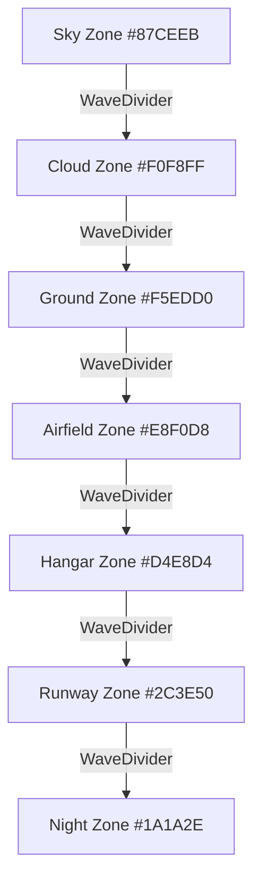

# Design Document: Rory's World Redesign

## Overview

This design transforms the AWS Cloud Club Global City website into a unified "Rory's World" cartoon storybook environment. The redesign replaces the current sky-gradient aesthetic with a zone-based illustrated world where each page scrolls through distinct background regions — sky, cloud, ground, airfield, hangar, runway, and night — connected by smooth SVG WaveDivider transitions.

The architecture preserves all existing functionality (routes, forms, API, chatbot) while introducing a new design token system, cartoon card/button classes, reusable zone wrapper components, and WaveDivider transitions. The implementation follows a progressive enhancement approach: update globals.css tokens first, then refactor zone compositions, then update individual components.

### Key Design Decisions

1. **CSS-first animation strategy**: All hover effects, float animations, pulse dots, and cloud drift use CSS keyframes and transitions — no JavaScript animation runtime for decorative effects. Framer Motion is reserved exclusively for scroll-triggered entrance animations (ScrollReveal).
2. **Zone background via section wrappers**: Each section sets its own background via CSS class (`.zone-sky`, `.zone-cloud`, etc.) with position:relative and overflow:visible to support WaveDivider children.
3. **Single WaveDivider component with 4 path variants**: Rather than separate CloudDivider, GrassDivider, RunwayDivider components, one unified `WaveDivider` component accepts `type`, `fillColor`, and `flip` props.
4. **Incremental refactor over rewrite**: Existing components are patched to match the new design system. Only components with fundamentally different structures (dividers, PageHero) are created fresh.

---

## Architecture

### High-Level Component Hierarchy

```
RootLayout (layout.tsx)
├── SkipNav
├── Navigation (Navbar)
├── {children} ← Page content
│   ├── Home Page (page.tsx)
│   │   ├── HeroSection [zone-sky]
│   │   ├── WaveDivider (sky → cloud)
│   │   ├── StatsStrip [zone-cloud]
│   │   ├── AboutSnippet [zone-cloud]
│   │   ├── WaveDivider (cloud → ground)
│   │   ├── MissionBoardPreview [zone-ground]
│   │   ├── WaveDivider (ground → airfield)
│   │   ├── SignalBoardPreview [zone-airfield]
│   │   ├── WaveDivider (airfield → hangar)
│   │   ├── CrewPreview [zone-hangar]
│   │   ├── WaveDivider (hangar → runway)
│   │   ├── WingmanCTA [zone-runway]
│   │   ├── WaveDivider (runway → night)
│   │   ├── EnlistSection [zone-night]
│   │   ├── PartnersMarquee [zone-night]
│   │   └── Footer [zone-night]
│   │
│   └── Inner Pages (/about, /missions, etc.)
│       ├── PageHero [zone-sky]
│       ├── WaveDivider (sky → next zone)
│       ├── Content sections [various zones]
│       ├── WaveDivider (content → night)
│       └── Footer [zone-night]
│
├── Footer
└── WingmanFAB (hidden on /wingman)
```

### Zone Flow Diagram



### Inner Page Zone Maps

| Route | Zone Flow |
|-------|-----------|
| `/about` | sky → cloud → ground → night |
| `/missions` | sky → ground → night |
| `/crew` | sky → hangar → night |
| `/signals` | sky → cloud → night |
| `/wingman` | sky → hangar → night |
| `/enlist` | sky → ground → night |

---

## Components and Interfaces

### New Components

#### WaveDivider

```typescript
interface WaveDividerProps {
  /** Wave path shape variant (1–4) */
  type?: 1 | 2 | 3 | 4;
  /** Fill color — should match the DESTINATION zone color */
  fillColor: string;
  /** Flip vertically for inverted placement */
  flip?: boolean;
  /** Additional CSS classes */
  className?: string;
}
```

Renders an inline SVG with one of 4 predefined wave path `d` attributes. Positioned absolute bottom:-1px, z-index:10, width:100%. Height responsive via CSS: 40px mobile, 60px tablet, 80px desktop.

#### PageHero

```typescript
interface PageHeroProps {
  /** Page title displayed in Bebas Neue */
  title: string;
  /** Subtitle text below title */
  subtitle: string;
  /** Optional Rory image variant path */
  roryVariant?: 'waving' | 'curious';
  /** Destination zone color for the WaveDivider at bottom */
  nextZoneColor: string;
}
```

Renders a sky-zone banner with centered title, subtitle, Rory mascot with float animation, and a WaveDivider at the bottom transitioning to the next zone.

#### ZoneSection

```typescript
interface ZoneSectionProps {
  /** Zone identifier for background styling */
  zone: 'sky' | 'cloud' | 'ground' | 'airfield' | 'hangar' | 'runway' | 'night';
  /** Section content */
  children: React.ReactNode;
  /** Additional CSS classes */
  className?: string;
  /** HTML id for skip-nav targets */
  id?: string;
}
```

A wrapper component that applies the correct zone background class, `position: relative`, and `overflow: visible`. Ensures consistent section wrapper standards.

#### FloatingClouds

```typescript
interface FloatingCloudsProps {
  /** Number of cloud elements (default: 5) */
  count?: number;
  /** Additional CSS classes */
  className?: string;
}
```

Pure CSS-animated white ellipses. Renders inside sky zone sections. Uses CSS `@keyframes cloud-float` with staggered durations (15–30s). No JS animation runtime.

### Modified Components

| Component | Changes |
|-----------|---------|
| `Navigation` | Update scroll detection to frosted white glass; adjust colors for sky zone transparency; add skip-nav compliance |
| `HeroSection` | Replace current sky gradient with `zone-sky` class; remove parallax layers; simplify to mascot + headline + CTAs |
| `StatsStrip` | Apply `zone-cloud` background; update card styles to `.card-cartoon` |
| `AboutSnippet` | Apply `zone-cloud` background; cartoon card styling |
| `MissionBoardPreview` | Apply `zone-ground` background; update MissionCard to cartoon style with status dot |
| `SignalBoardPreview` | Apply `zone-airfield` background; update to AnnouncementRow pattern |
| `CrewPreview` | Apply `zone-hangar` background; replace 3D flip with initials avatar card |
| `WingmanCTA` | Apply `zone-runway` background (replacing baby blue) |
| `EnlistSection` | Apply `zone-night` background; white text; remove rainbow gradient |
| `PartnersMarquee` | Apply `zone-night` background with horizontal gradient fade masks |
| `CrewCard` | Remove 3D flip; implement circular initials avatar with solid color |
| `MissionCard` | Add colored top accent bar, pulsing status dot, tag pills |
| `WingmanFAB` | Add CSS pulse idle animation; clip-path expand on open |
| `Footer` | Apply `zone-night` background styling |

### Card Component Specifications

#### MissionCard (updated)

```typescript
interface MissionCardProps {
  title: string;
  date: string;
  description: string;
  status: 'active' | 'upcoming' | 'completed';
  tags: string[];
}
```

Renders `.card-cartoon` with:
- 4px colored top accent bar (green=active, orange=upcoming, gray=completed)
- Pulsing status dot (CSS keyframe, disabled in reduced-motion)
- Tag pills row using `.cartoon-badge` class

#### CrewCard (updated)

```typescript
interface CrewCardProps {
  name: string;
  role: string;
  office: string;
  accentColor: string;
}
```

Renders `.card-cartoon` with:
- Colored top bar (4px, `accentColor`)
- Circular initials avatar: 64px diameter, solid `accentColor` background, white centered initials (first letter of first + last name)
- Name in `--font-display`, role in `--font-body`
- No photograph, no 3D flip

#### AnnouncementRow

```typescript
interface AnnouncementRowProps {
  text: string;
  timestamp: string;
  pinned?: boolean;
}
```

Renders flex-row with:
- Optional pulsing orange dot (pinned indicator)
- Formatted timestamp in `--font-mono`
- Announcement text in `--font-body`

---

## Data Models

### Zone Configuration

```typescript
/** Zone color mapping — single source of truth */
export const ZONE_COLORS = {
  sky: '#87CEEB',
  cloud: '#F0F8FF',
  ground: '#F5EDD0',
  airfield: '#E8F0D8',
  hangar: '#D4E8D4',
  runway: '#2C3E50',
  night: '#1A1A2E',
} as const;

export type ZoneName = keyof typeof ZONE_COLORS;
```

### Page Zone Flow Configuration

```typescript
/** Zone sequence for each route */
export const PAGE_ZONE_FLOWS: Record<string, ZoneName[]> = {
  '/': ['sky', 'cloud', 'cloud', 'ground', 'airfield', 'hangar', 'runway', 'night', 'night', 'night'],
  '/about': ['sky', 'cloud', 'ground', 'night'],
  '/missions': ['sky', 'ground', 'night'],
  '/crew': ['sky', 'hangar', 'night'],
  '/signals': ['sky', 'cloud', 'night'],
  '/wingman': ['sky', 'hangar', 'night'],
  '/enlist': ['sky', 'ground', 'night'],
} as const;
```

### WaveDivider Path Data

```typescript
/** SVG path d-attributes for 4 wave variants */
export const WAVE_PATHS: Record<1 | 2 | 3 | 4, string> = {
  1: 'M0,64 C320,120 640,20 960,80 C1120,100 1280,40 1440,64 L1440,160 L0,160 Z',
  2: 'M0,80 C240,40 480,120 720,60 C960,0 1200,100 1440,80 L1440,160 L0,160 Z',
  3: 'M0,40 C360,100 720,20 1080,80 C1260,100 1380,60 1440,40 L1440,160 L0,160 Z',
  4: 'M0,96 C180,60 360,120 540,80 C720,40 900,100 1080,60 C1260,20 1380,80 1440,96 L1440,160 L0,160 Z',
} as const;
```

### Design Token Structure (CSS Variables)

```css
:root {
  /* Zone backgrounds */
  --zone-sky: #87CEEB;
  --zone-cloud: #F0F8FF;
  --zone-ground: #F5EDD0;
  --zone-airfield: #E8F0D8;
  --zone-hangar: #D4E8D4;
  --zone-runway: #2C3E50;
  --zone-night: #1A1A2E;

  /* Brand accents */
  --accent-orange: #FF8C00;
  --accent-blue: #00B8D4;
  --accent-warm: #FFB300;
  --accent-green: #00C853;
  --accent-coral: #FF6E6E;

  /* Text */
  --primary-text: #1A1A2A;
  --secondary-text: #4A4A6A;
  --text-on-dark: #E0E0E0;

  /* Structural */
  --border-color: #1A1A2A;
  --radius-card: 16px;
  --radius-button: 999px;
  --shadow-offset: 3px;

  /* Typography */
  --font-heading: 'Bebas Neue', sans-serif;
  --font-body: 'Nunito', sans-serif;
  --font-mono: 'JetBrains Mono', monospace;

  /* Spacing */
  --section-padding-desktop: 80px;
  --section-padding-mobile: 40px;
  --container-max: 1280px;
}
```

---

## File Structure

### New Files

```
src/
├── components/
│   ├── zones/
│   │   ├── WaveDivider.tsx          # Unified SVG wave transition component
│   │   ├── ZoneSection.tsx          # Zone wrapper with correct bg + positioning
│   │   └── FloatingClouds.tsx       # CSS-only animated cloud ellipses
│   ├── hero/
│   │   └── PageHero.tsx             # Reusable inner-page hero banner
│   ├── cards/
│   │   └── AnnouncementRow.tsx      # Signal entry flex-row component
│   └── sections/
│       └── WingmanChatPreview.tsx    # Chat bubble mockup for CTA section
├── lib/
│   └── zones.ts                     # Zone colors, page flows, wave paths constants
└── styles/
    └── cartoon-keyframes.css        # Float-rory, pulse-dot, cloud-float keyframes
```

### Modified Files

```
src/
├── app/
│   ├── globals.css                  # Updated token system (zone colors, cartoon vars)
│   ├── page.tsx                     # Home page zone flow with WaveDividers
│   ├── layout.tsx                   # Add Nunito font, update font variables
│   ├── about/page.tsx               # Zone flow: sky → cloud → ground → night
│   ├── missions/page.tsx            # Zone flow: sky → ground → night
│   ├── crew/page.tsx                # Zone flow: sky → hangar → night
│   ├── signals/page.tsx             # Zone flow: sky → cloud → night
│   ├── wingman/page.tsx             # Zone flow: sky → hangar → night
│   └── enlist/page.tsx              # Zone flow: sky → ground → night
├── components/
│   ├── layout/Navigation.tsx        # Sky-transparent → frosted-white transition
│   ├── layout/Footer.tsx            # Night zone background styling
│   ├── hero/HeroSection.tsx         # Simplified sky zone hero
│   ├── cards/MissionCard.tsx        # Cartoon card + status dot + tags
│   ├── cards/CrewCard.tsx           # Initials avatar, no 3D flip
│   ├── cards/BenefitCard.tsx        # Renamed to EnlistBenefitCard pattern
│   ├── sections/StatsStrip.tsx      # Cloud zone background
│   ├── sections/AboutSnippet.tsx    # Cloud zone background
│   ├── sections/MissionBoardPreview.tsx  # Ground zone background
│   ├── sections/SignalBoardPreview.tsx   # Airfield zone background
│   ├── sections/CrewPreview.tsx     # Hangar zone background
│   ├── sections/WingmanCTA.tsx      # Runway zone background
│   ├── sections/EnlistSection.tsx   # Night zone, white text, no rainbow
│   ├── sections/PartnersMarquee.tsx # Night zone with fade masks
│   ├── wingman/WingmanFAB.tsx       # Pulse idle + clip-path expand
│   └── animations/ScrollReveal.tsx  # Ensure viewport once:true + stagger
├── lib/constants.ts                 # Update color tokens to match new system
└── styles/animations.css            # Add float-rory, pulse-dot keyframes
```

### Removed Files

```
src/components/effects/
├── CloudDivider.tsx      # Replaced by WaveDivider
├── GrassDivider.tsx      # Replaced by WaveDivider
└── RunwayDivider.tsx     # Replaced by WaveDivider
```

---

## CSS Strategy

### Token Layer (globals.css `:root`)

All design tokens live in CSS custom properties. Components reference tokens via `var(--token-name)`. This allows theme-wide changes from a single file.

### Component Classes (`@layer components`)

Reusable classes defined in globals.css:

```css
/* Card system */
.card-cartoon { /* 2px border, 16px radius, 3px shadow, white bg */ }
.card-cartoon:hover { /* translate(-3px,-3px), 6px shadow */ }

/* Button system */
.btn-primary { /* orange gradient, white text, pill, 3px shadow */ }
.btn-ghost { /* transparent bg, dark text, pill, 3px shadow */ }
.btn-ghost-dark { /* transparent bg, white text, light border */ }

/* Zone backgrounds */
.zone-sky { background-color: var(--zone-sky); }
.zone-cloud { background-color: var(--zone-cloud); }
.zone-ground { background-color: var(--zone-ground); }
.zone-airfield { background-color: var(--zone-airfield); }
.zone-hangar { background-color: var(--zone-hangar); }
.zone-runway { background-color: var(--zone-runway); color: var(--text-on-dark); }
.zone-night { background-color: var(--zone-night); color: var(--text-on-dark); }

/* Section wrapper for WaveDivider parents */
.zone-section { position: relative; overflow: visible; }

/* Headline underline */
.headline-underline::after {
  content: '';
  display: block;
  width: 60px;
  height: 3px;
  background: var(--accent-orange);
  margin: 12px auto 0;
}
```

### Utility Layer (Tailwind)

Tailwind utilities handle one-off spacing, flex/grid layouts, and responsive modifiers. No custom Tailwind theme extensions needed — everything routes through CSS variables.

### Animation Layer (separate CSS files)

Keyframe animations in `src/styles/animations.css` and new `src/styles/cartoon-keyframes.css`:

```css
@keyframes float-rory {
  0%, 100% { transform: translateY(0); }
  50% { transform: translateY(-8px); }
}

@keyframes pulse-dot {
  0%, 100% { transform: scale(1); opacity: 1; }
  50% { transform: scale(1.4); opacity: 0.6; }
}

@keyframes cloud-float {
  0% { transform: translateX(-10%); }
  100% { transform: translateX(110%); }
}

@keyframes fab-pulse {
  0%, 100% { transform: scale(1); }
  50% { transform: scale(1.06); }
}
```

### Reduced Motion

All keyframe classes are disabled under `@media (prefers-reduced-motion: reduce)`. Hover transitions retain static shadow changes but disable transforms.

---

## Animation Implementation Patterns

### Pattern 1: CSS-Only Decorative Animations

Used for: FloatingClouds, float-rory, pulse dots, FAB idle pulse.

```css
.float-rory {
  animation: float-rory 3s ease-in-out infinite;
}

@media (prefers-reduced-motion: reduce) {
  .float-rory { animation: none; }
}
```

### Pattern 2: Framer Motion Scroll Reveals

Used for: Section content entrance animations.

```tsx
<motion.div
  initial={{ opacity: 0, y: 30 }}
  whileInView={{ opacity: 1, y: 0 }}
  viewport={{ once: true, amount: 0.15 }}
  transition={{ duration: 0.5, staggerChildren: 0.06 }}
>
  {children}
</motion.div>
```

### Pattern 3: CSS Transitions for Interactivity

Used for: Card hover, button hover/press, nav scroll transition.

```css
.card-cartoon {
  transition: transform 0.25s cubic-bezier(0.34, 1.56, 0.64, 1),
              box-shadow 0.25s ease;
}
.card-cartoon:hover {
  transform: translate(-3px, -3px);
  box-shadow: 6px 6px 0 var(--border-color);
}
```

### Pattern 4: IntersectionObserver for CountUp

Used for: StatsStrip count-up numbers.

```typescript
const observer = new IntersectionObserver(([entry]) => {
  if (entry.isIntersecting) {
    startCountUp();
    observer.disconnect(); // Fire once only
  }
}, { threshold: 0.5 });
```

### Pattern 5: Page Visibility Pause

Used for: All CSS animations when tab is hidden.

```typescript
useEffect(() => {
  const handler = () => {
    document.documentElement.classList.toggle(
      'animations-paused',
      document.hidden
    );
  };
  document.addEventListener('visibilitychange', handler);
  return () => document.removeEventListener('visibilitychange', handler);
}, []);
```

---

## Responsive Breakpoint Strategy

| Breakpoint | Width | Layout Changes |
|------------|-------|----------------|
| Base (mobile) | 0–767px | Single column, 40px section padding, 40px WaveDivider height, full-width buttons, hamburger nav |
| md (tablet) | 768–1023px | 2-column grids, 60px section padding, 60px WaveDivider height, inline nav links |
| lg (desktop) | 1024px+ | 3-column grids, 80px section padding, 80px WaveDivider height, full nav with CTA |

### Mobile-First Implementation

```css
/* Base: mobile */
.stats-grid { display: grid; grid-template-columns: repeat(2, 1fr); gap: 1rem; }
.section-pad { padding: 40px 1.5rem; }
.wave-h { height: 40px; }

/* md: tablet */
@media (min-width: 768px) {
  .stats-grid { grid-template-columns: repeat(4, 1fr); }
  .section-pad { padding: 60px 2rem; }
  .wave-h { height: 60px; }
}

/* lg: desktop */
@media (min-width: 1024px) {
  .section-pad { padding: 80px 2rem; }
  .wave-h { height: 80px; }
}
```

All interactive elements maintain 48px minimum touch targets on mobile via `min-h-12 min-w-12` Tailwind utilities.

---

## Performance Considerations

1. **GPU-only animations**: All animations use exclusively `transform` and `opacity` — no `width`, `height`, `top`, `left`, or `margin` animations.
2. **Inline SVG WaveDividers**: No network requests for divider graphics. SVG paths are hardcoded in the component.
3. **Dynamic imports for below-fold sections**: Sections below the hero use `next/dynamic` for code splitting.
4. **Priority loading for hero image**: `next/image` with `priority` attribute for above-fold Rory mascot.
5. **IntersectionObserver disconnect**: CountUp and other one-shot observers disconnect after firing.
6. **CSS-only cloud animations**: FloatingClouds uses zero JavaScript — pure CSS keyframes with GPU-accelerated transforms.
7. **Page Visibility API**: All animations (CSS keyframes + JS intervals) pause when the browser tab is hidden.
8. **Font loading**: Google Fonts loaded via `next/font` with `display: swap` to prevent FOIT.
9. **No tsParticles/GSAP**: Removed heavy animation libraries. All effects achieved with CSS + Framer Motion viewport triggers.
10. **Viewport once:true**: ScrollReveal animations fire once and never re-trigger, reducing ongoing computation.

---

## Correctness Properties

*A property is a characteristic or behavior that should hold true across all valid executions of a system — essentially, a formal statement about what the system should do. Properties serve as the bridge between human-readable specifications and machine-verifiable correctness guarantees.*

### Property 1: WaveDivider renders correct fill for any valid color

*For any* valid CSS color string and any boolean flip value, the WaveDivider component SHALL render an SVG element whose path fill attribute equals the provided color, and whose container transform includes `scaleY(-1)` if and only if flip is true.

**Validates: Requirements 4.2**

### Property 2: CrewCard computes correct initials for any valid name

*For any* non-empty name string containing at least one word, the CrewCard SHALL display initials consisting of the uppercase first character of the first word and (if present) the uppercase first character of the last word.

**Validates: Requirements 9.4**

### Property 3: MissionCard renders all required fields for any valid mission data

*For any* valid mission data object containing title, date, description, status, and tags array, the MissionCard SHALL render all five data fields in the DOM output — the title text, date text, description text, a status badge element, and one tag pill element per tag.

**Validates: Requirements 9.3**

### Property 4: AnnouncementRow renders all required fields for any valid announcement

*For any* valid announcement data containing text, timestamp, and pinned boolean, the AnnouncementRow SHALL render the timestamp in a monospace-styled element, the text content, and a pinned dot indicator if and only if pinned is true.

**Validates: Requirements 9.5**

---

## Error Handling

### Missing Zone Color

If a `ZoneSection` receives an invalid zone name, it falls back to `--zone-cloud` (lightest neutral) and logs a development-only warning via `console.warn`.

### WaveDivider Invalid Type

If `WaveDivider` receives a type outside 1–4, it defaults to type 1. TypeScript narrowing prevents this at compile time, but runtime fallback protects against dynamic prop injection.

### Image Loading Failures

The PageHero Rory mascot uses `next/image` with a fallback alt text. If the image fails to load, the layout remains stable (fixed height container) and the alt text is displayed.

### Font Loading Failures

Fonts are loaded with `display: swap` and include system-font fallback stacks. If Google Fonts CDN is unavailable, the site remains readable with system fonts.

### IntersectionObserver Unavailability

CountUp checks for `IntersectionObserver` support. If unavailable (legacy browsers), it immediately displays the final target values without animation.

### Reduced Motion Preferences

When `prefers-reduced-motion: reduce` is active:
- All CSS keyframe animations are disabled
- ScrollReveal shows content immediately (no delay)
- CountUp displays final values without animation
- FloatingClouds renders static positioned elements
- Card/button hovers show only shadow changes, no transforms

---

## Testing Strategy

### Unit Tests (Vitest + React Testing Library)

- Verify each component renders correct DOM structure with given props
- Test responsive class application at breakpoints
- Test accessibility: skip-nav presence, aria attributes, focus indicators
- Test navbar scroll state transitions
- Test mobile menu open/close and keyboard navigation
- Test that zone section wrappers apply correct background classes

### Property-Based Tests (Vitest + fast-check)

Property-based testing validates universal correctness properties across randomized inputs. Each property test runs a minimum of 100 iterations.

- **Property 1**: Generate random hex color strings and boolean flip values → verify WaveDivider SVG fill and transform
  - Tag: `Feature: rorys-world-redesign, Property 1: WaveDivider renders correct fill for any valid color`
- **Property 2**: Generate random name strings (1–3 words) → verify CrewCard initials computation
  - Tag: `Feature: rorys-world-redesign, Property 2: CrewCard computes correct initials for any valid name`
- **Property 3**: Generate random mission data objects → verify all fields present in rendered output
  - Tag: `Feature: rorys-world-redesign, Property 3: MissionCard renders all required fields for any valid mission data`
- **Property 4**: Generate random announcement data → verify rendered structure matches pinned state
  - Tag: `Feature: rorys-world-redesign, Property 4: AnnouncementRow renders all required fields for any valid announcement`

### Integration Tests

- Home page renders full zone flow in correct order (sky → cloud → ground → airfield → hangar → runway → night)
- Each inner page renders correct zone sequence per requirements
- WaveDividers appear between every zone color change
- Enlist form submission works end-to-end via `/api/enlist`
- All routes resolve without 404 (/, /about, /missions, /crew, /signals, /wingman, /enlist, /apply → /enlist)
- WingmanFAB is hidden on /wingman route

### Accessibility Audit

- axe-core automated scans on all pages
- Manual keyboard navigation verification for nav, mobile menu, and interactive elements
- Contrast ratio validation for text on all 7 zone backgrounds
- Verified skip-nav link functionality

### Visual Regression (Manual)

- Screenshot comparison at 375px, 768px, and 1024px for each page
- WaveDivider seamlessness (no hairline gaps)
- Zone color accuracy against hex specifications
- Card hover states on desktop
